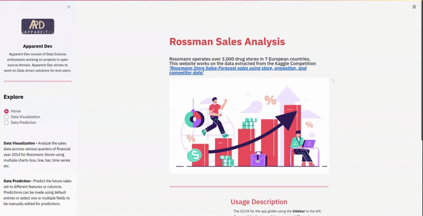
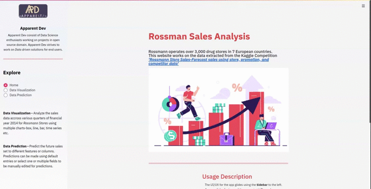
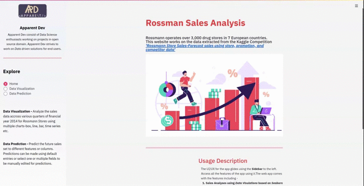

# Rossman Sales Analysis and Prediction
Rossmann operates over 3,000 drug stores in 7 European countries.
This repository works on the data extracted from the Kaggle Competition
['Rossmann Store Sales-Forecast sales using store, promotion, and competitor data'](https://www.kaggle.com/c/rossmann-store-sales/overview)

## Overview
This app is a demonstration of how data solutions like Data Analysis and Forecast can easily be made end user friendly, such type
of apps (web apps) can be used to get an overview of a company and its performance in the recent time.
<br><br>For the ease of people reading it we have created the seprate folder for seprate modules : <br>
* [data](/data) : contains all the data files used in the repo inculding the images used in the app, configure the [config.py](/streamlit_app/config.py) using resources from here<br>
* [model](/model) : conatains model <i>sales.sav</i> file to be used by [pickle](https://docs.python.org/3/library/pickle.html) along with the model notebook with explanation of the model used <br>
* [streamlit app](/streamlit_app) :  contains the actual web app made using [streamlit framework](https://docs.streamlit.io/_/downloads/en/latest/pdf/) <br>
* [visualization](/visualization) :  contains the notebook for detailed discription of the visualization techniques used. <br>

## Usage Instruction 
To run the app on your local machine follow the following instruction after cloning the repo.
In [Streamlit App folder](/streamlit_app) : 
* Install all the dependecies using [requirements.txt](/streamlit_app/requirements.txt) using 
<br>```pip install -r requirements.txt```
* Set all the correct local path\directory for the data dependencies from [data](\data) in [config.py](\streamlit_app]config.py) 

## Deployment 
The app is deployed using the [heroku](https://heroku.com/) as <b>PAS</b>.<br> 
Follow the following link to check the live deployment of the app.<br>
[Rossman Sales Analysis and Prediction](https://rossman-streamlit.herokuapp.com/)

## Demo
##### Home page for the web app

##### Data Visualization for analysis

##### Sales forecast



#### Authored By:
- [Archit Sharma](https://www.linkedin.com/in/archiit-sharmaa/)
#### Project By :
- [Archit Sharma](https://www.linkedin.com/in/archiit-sharmaa/)
- [Prakhar Pandey](https://www.linkedin.com/in/prakhar-pandey-a307b7191/)
- [Devansh Kaushik](https://www.linkedin.com/in/devansh-kaushik-b5912b174/)
